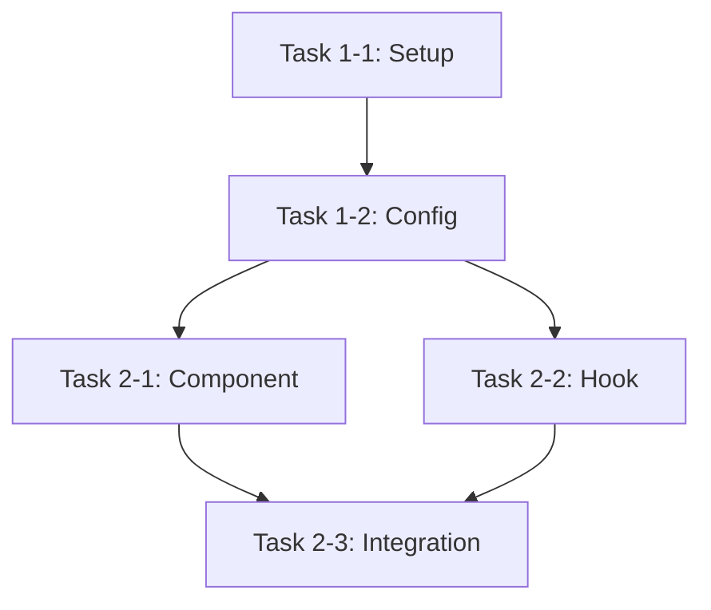

# Speckit Tasks Command

## Purpose

The `/speckit.tasks` command transforms the implementation plan into granular, actionable tasks that can be assigned, tracked, and completed independently. Each task represents 2-4 hours of focused work and includes clear acceptance criteria.

## Prerequisites

Before running `/speckit.tasks`:
- ✅ Implementation plan exists at `.specify/specs/[###-feature-name]/plan.md`
- ✅ All design documents are complete (research, data-model, component-hierarchy, contracts, quickstart)
- ✅ Plan phases are clearly defined with deliverables
- ✅ Feature branch is checked out

## Workflow

### Step 1: Read Implementation Plan

Read the `plan.md` file to understand:
- Implementation phases and timeline
- Deliverables per phase
- Files to create
- Testing requirements
- Dependencies between tasks

### Step 2: Create Task Breakdown

For each phase in the plan, break down deliverables into atomic tasks.

**Task Granularity Rules**:
- Each task should take 2-4 hours (half a work day max)
- Tasks should be independently testable
- Tasks should have clear start/end points
- Dependencies should be minimal and explicit

**Task Structure**:
```markdown
### Task [PHASE]-[NUMBER]: [Clear Action Verb] [Component/Feature]

**Phase**: [Phase Number and Name]  
**Estimated Time**: [2-4 hours]  
**Dependencies**: [Task IDs this depends on, or "None"]  
**Priority**: [P0 (blocking) / P1 (high) / P2 (medium) / P3 (low)]

**Description**:
[1-2 sentences describing what needs to be done]

**Files to Create/Modify**:
- `path/to/file1.tsx` - [What this file does]
- `path/to/file2.ts` - [What this file does]

**Acceptance Criteria**:
- [ ] [Specific, testable criterion 1]
- [ ] [Specific, testable criterion 2]
- [ ] [Specific, testable criterion 3]

**Testing**:
- [How to verify this task is complete]

**Notes**:
- [Any important context, gotchas, or references]
```

### Step 3: Organize by Phase

Group tasks by implementation phase:
- Phase 1: Foundation & Landing
- Phase 2: Authentication
- Phase 3: Dashboard & Organizations
- Phase 4: Team Management
- Phase 5: Platform Administration

### Step 4: Identify Dependencies

Mark task dependencies clearly:
- Setup tasks (install dependencies, configure tools)
- Foundation tasks (hooks, API client, types)
- Feature tasks (components, pages)
- Integration tasks (connect components to data)
- Testing tasks (unit tests, E2E tests)

### Step 5: Create Task Document

Create `.specify/specs/[###-feature-name]/tasks.md` with:
- Task summary (total count, estimated time)
- Tasks organized by phase
- Dependency graph (visual representation)
- Progress tracking checkboxes

## Task Breakdown Template

```markdown
# Task Breakdown: [Feature Name]

**Branch**: `###-feature-name`  
**Created**: [DATE]  
**Plan**: [link to plan.md]

## Summary

**Total Tasks**: [COUNT]  
**Estimated Time**: [TOTAL HOURS] hours (~[WEEKS] weeks)  
**Current Phase**: Not Started

**Progress**: 0 / [COUNT] tasks complete (0%)

---

## Phase 1: [Phase Name] ([X] tasks, [Y] hours)

### Task 1-1: [Action] [Component]
[Full task structure as shown above]

### Task 1-2: [Action] [Component]
[Full task structure as shown above]

---

## Phase 2: [Phase Name] ([X] tasks, [Y] hours)

[Continue with all tasks...]

---

## Task Dependency Graph



---

## Progress Tracking

### Phase 1: Foundation & Landing
- [ ] Task 1-1
- [ ] Task 1-2
- [ ] Task 1-3
[etc.]

### Phase 2: Authentication
- [ ] Task 2-1
- [ ] Task 2-2
[etc.]

---

## Task Prioritization

**P0 - Blocking (Must Do First)**:
- Task 1-1, 1-2, 1-3 (setup and configuration)

**P1 - High Priority (Core Features)**:
- Task 2-1, 2-2, 3-1, 3-2 (authentication, dashboard)

**P2 - Medium Priority (Important Features)**:
- Task 4-1, 4-2 (team management, RBAC)

**P3 - Low Priority (Admin Features)**:
- Task 5-1, 5-2 (platform admin)

---

## Quick Reference

**Current Sprint**: Phase [X]  
**Next Task**: Task [X-Y]  
**Blocked Tasks**: [List any blocked tasks]

---

## Notes

- All tasks assume constitution compliance (Next.js, TypeScript, shadcn, TanStack Query)
- Each task should be committed separately with descriptive commit message
- Run tests after each task completion
- Update this document as tasks are completed
```

## Task Breakdown Guidelines

### Foundation Tasks (Phase 1)
Break down into:
1. **Dependency Installation** (1 task)
   - Install all npm packages
   - Install shadcn components for phase
   
2. **Configuration Setup** (1-2 tasks)
   - Configure Sentry
   - Set up TanStack Query provider
   - Create API client

3. **Type Definitions** (1 task)
   - Copy and organize type definitions

4. **Landing Page** (3-4 tasks)
   - Create navigation component
   - Create hero section
   - Create features section
   - Create footer

### Authentication Tasks (Phase 2)
Break down into:
1. **Auth Infrastructure** (2-3 tasks)
   - Create auth hooks
   - Create auth API client
   - Set up middleware

2. **Auth UI** (4-6 tasks)
   - Create auth layout
   - Create sign-in form
   - Create sign-up form
   - Create password reset
   - Create OTP components

3. **Auth Integration** (1-2 tasks)
   - Connect forms to API
   - Test auth flows

### Dashboard Tasks (Phase 3)
Break down into:
1. **Dashboard Infrastructure** (2-3 tasks)
   - Install sidebar-07
   - Create organization hooks
   - Create dashboard layout

2. **Dashboard Components** (3-4 tasks)
   - Create workspace switcher
   - Create user menu
   - Create empty state
   - Create org creation dialog

3. **Dashboard Integration** (1-2 tasks)
   - Connect components to data
   - Test workspace switching

### Team Management Tasks (Phase 4)
Break down into:
1. **Team Infrastructure** (2-3 tasks)
   - Create member/invitation hooks
   - Create permissions hook
   - Set up RBAC helpers

2. **Team Components** (4-6 tasks)
   - Create member table
   - Create invitation dialog
   - Create pending invitations view
   - Create invitation acceptance page
   - Create role selector
   - Create remove member dialog

3. **RBAC Implementation** (2-3 tasks)
   - Implement permission-based rendering
   - Add role restrictions
   - Test RBAC enforcement

### Admin Tasks (Phase 5)
Break down into:
1. **Admin Infrastructure** (2-3 tasks)
   - Create admin hooks
   - Create admin layout
   - Set up admin routes

2. **Admin Components** (5-8 tasks)
   - Create admin dashboard
   - Create org list/detail
   - Create activity table
   - Create compensation report
   - Create audit trail
   - Create role manager

3. **Admin Integration** (1-2 tasks)
   - Connect admin features
   - Test admin permissions

## Best Practices

### Task Naming
- Use action verbs: Create, Implement, Add, Set up, Configure
- Be specific: "Create sign-in form" not "Build auth"
- Include component/feature name

### Task Sizing
- If task > 4 hours, split it into smaller tasks
- If task < 1 hour, consider combining with related task
- Each task should produce tangible output (file, feature, test)

### Dependencies
- Minimize cross-phase dependencies
- Setup tasks should be completed first
- Infrastructure before UI
- Components before integration

### Acceptance Criteria
- Make criteria testable and objective
- Include both functionality and quality checks
- Reference spec requirements when applicable

### Testing
- Each task should include how to test it
- Manual testing steps for UI tasks
- Unit test requirements for logic
- Integration test checkpoints

## Output Format

When user invokes `/speckit.tasks`:

```
# Creating Task Breakdown: [Feature Name]

I'll break down the implementation plan into granular, actionable tasks.

## Analysis

Reading implementation plan...
- 5 phases identified
- [X] total deliverables
- Estimated [Y] development days

Breaking down Phase 1: Foundation & Landing...
- [N] tasks created (Setup, Landing Page, Configuration)

Breaking down Phase 2: Authentication...
- [N] tasks created (Auth Infrastructure, Auth UI, Integration)

Breaking down Phase 3: Dashboard & Organizations...
- [N] tasks created (Dashboard Infrastructure, Components, Integration)

Breaking down Phase 4: Team Management...
- [N] tasks created (Team Infrastructure, Components, RBAC)

Breaking down Phase 5: Platform Administration...
- [N] tasks created (Admin Infrastructure, Components, Integration)

## Task Summary

**Total Tasks**: [COUNT]
**Estimated Hours**: [HOURS] hours
**Estimated Timeline**: [WEEKS] weeks

**Tasks by Phase**:
- Phase 1: [N] tasks ([H] hours)
- Phase 2: [N] tasks ([H] hours)
- Phase 3: [N] tasks ([H] hours)
- Phase 4: [N] tasks ([H] hours)
- Phase 5: [N] tasks ([H] hours)

**Task Priorities**:
- P0 (Blocking): [N] tasks
- P1 (High): [N] tasks
- P2 (Medium): [N] tasks
- P3 (Low): [N] tasks

Created: tasks.md

## Next Steps

1. **Review Tasks**: Check tasks.md for completeness
2. **Adjust Estimates**: Refine time estimates if needed
3. **Assign Tasks**: Distribute tasks to team members
4. **Start Implementation**: Begin with Phase 1, Task 1-1
5. **Track Progress**: Update checkboxes as tasks complete

Ready to begin implementation? Run `/speckit.implement` to start coding!
```

## Integration with Other Commands

- **After `/speckit.plan`**: Creates granular tasks from plan phases
- **Before `/speckit.implement`**: Provides clear task list for implementation
- **Before `/speckit.taskstoissues`**: Can convert tasks to GitHub issues
- **During Implementation**: Reference for what to build next

## Notes

- Tasks should align with plan phases and deliverables
- Each task maps to quickstart.md steps where applicable
- Constitution compliance is assumed in all tasks
- Task estimates help with sprint planning
- Progress tracking helps measure velocity
- Tasks can be converted to GitHub issues for team collaboration

---

**Ready to break down your implementation plan into actionable tasks? Invoke `/speckit.tasks` with your feature branch checked out!**