# Task Breakdown: Accounts Module & Landing Page

**Branch**: `001-accounts`  
**Created**: November 15, 2025  
**Plan**: [plan.md](./plan.md)

## Summary

**Total Tasks**: 47  
**Estimated Time**: 140 hours (~17.5 days)  
**Current Phase**: Not Started

**Progress**: 0 / 47 tasks complete (0%)

---

## Phase 1: Foundation & Landing (10 tasks, 16 hours)

### Task 1-1: Install Core Dependencies
**Phase**: Phase 1 - Foundation & Landing  
**Estimated Time**: 2 hours  
**Dependencies**: None  
**Priority**: P0 (blocking)

**Description**: Install all npm packages required for the project including TanStack Query, Sentry, and related utilities.

**Files to Create/Modify**:
- `package.json` - Add dependencies

**Acceptance Criteria**:
- [ ] @tanstack/react-query and @tanstack/react-query-devtools installed
- [ ] @sentry/nextjs installed
- [ ] zod, react-hook-form, @hookform/resolvers installed
- [ ] date-fns, axios installed
- [ ] All dependencies compile without errors
- [ ] npm install completes successfully

**Testing**: Run `npm install` and verify no errors

**Notes**: Foundation for all subsequent work

---

### Task 1-2: Install shadcn Components (Phase 1)
**Phase**: Phase 1 - Foundation & Landing  
**Estimated Time**: 1 hour  
**Dependencies**: Task 1-1  
**Priority**: P0 (blocking)

**Description**: Install shadcn components needed for landing page and initial setup.

**Files to Create/Modify**:
- `components/ui/button.tsx` - Auto-generated
- `components/ui/card.tsx` - Auto-generated

**Acceptance Criteria**:
- [ ] button component installed
- [ ] card component installed
- [ ] Components render without errors
- [ ] Tailwind config updated

**Testing**: Import and render each component in a test page

**Notes**: Use `npx shadcn@latest add button card`

---

### Task 1-3: Configure Sentry
**Phase**: Phase 1 - Foundation & Landing  
**Estimated Time**: 2 hours  
**Dependencies**: Task 1-1  
**Priority**: P0 (blocking)

**Description**: Set up Sentry for error tracking and performance monitoring.

**Files to Create/Modify**:
- `instrumentation.ts` - Sentry registration
- `sentry.client.config.ts` - Client config
- `sentry.server.config.ts` - Server config
- `.env.local` - Sentry DSN and keys

**Acceptance Criteria**:
- [ ] Sentry project created and DSN obtained
- [ ] Client-side error tracking configured
- [ ] Server-side error tracking configured
- [ ] Test error captured in Sentry dashboard
- [ ] Performance monitoring enabled
- [ ] Sampling rates configured (10% traces)

**Testing**: Trigger test error and verify in Sentry dashboard

**Notes**: Follow Sentry Next.js setup wizard

---

### Task 1-4: Set Up TanStack Query Provider
**Phase**: Phase 1 - Foundation & Landing  
**Estimated Time**: 2 hours  
**Dependencies**: Task 1-1  
**Priority**: P0 (blocking)

**Description**: Configure TanStack Query with client setup and provider wrapper.

**Files to Create/Modify**:
- `lib/query-client.ts` - Query client configuration
- `app/providers.tsx` - Query and toast providers
- `app/layout.tsx` - Wrap with providers

**Acceptance Criteria**:
- [ ] QueryClient configured with retry logic
- [ ] Default staleTime set to 5 minutes
- [ ] React Query DevTools enabled in development
- [ ] Provider wraps app in root layout
- [ ] Toast notifications work
- [ ] No hydration errors

**Testing**: Open DevTools, verify QueryClient active

**Notes**: See quickstart.md Phase 1 for implementation

---

### Task 1-5: Create API Client
**Phase**: Phase 1 - Foundation & Landing  
**Estimated Time**: 2 hours  
**Dependencies**: Task 1-1  
**Priority**: P0 (blocking)

**Description**: Build Axios API client with interceptors for auth and error handling.

**Files to Create/Modify**:
- `lib/api/client.ts` - Axios instance with interceptors

**Acceptance Criteria**:
- [ ] Axios instance created with base URL
- [ ] Request interceptor adds auth token from cookie
- [ ] Response interceptor handles 401/403 errors
- [ ] Timeout configured (10 seconds)
- [ ] Sentry integration for API errors
- [ ] Type-safe request/response helpers

**Testing**: Make test API call, verify interceptors fire

**Notes**: Base URL from environment variable

---

### Task 1-6: Copy Type Definitions
**Phase**: Phase 1 - Foundation & Landing  
**Estimated Time**: 1 hour  
**Dependencies**: None  
**Priority**: P0 (blocking)

**Description**: Copy TypeScript types from contracts/types.ts to lib/types/.

**Files to Create/Modify**:
- `lib/types/index.ts` - All entity and API types

**Acceptance Criteria**:
- [ ] All types from contracts/types.ts copied
- [ ] Exports organized and accessible
- [ ] No TypeScript compilation errors
- [ ] Types importable from other files

**Testing**: Import types in test file, verify no errors

**Notes**: Direct copy from contracts/types.ts

---

### Task 1-7: Create Landing Page Navigation
**Phase**: Phase 1 - Foundation & Landing  
**Estimated Time**: 2 hours  
**Dependencies**: Task 1-2  
**Priority**: P1 (high)

**Description**: Build responsive navigation header with logo and CTA buttons.

**Files to Create/Modify**:
- `components/landing/Navigation.tsx` - Header component

**Acceptance Criteria**:
- [ ] Logo/brand name displayed
- [ ] Sign In and Sign Up buttons
- [ ] Responsive mobile menu (hamburger)
- [ ] Sticky header on scroll
- [ ] Accessible keyboard navigation
- [ ] Client Component for mobile menu state

**Testing**: Test on mobile (320px) and desktop (1920px)

**Notes**: Use lucide-react for menu icon

---

### Task 1-8: Create Landing Page Hero
**Phase**: Phase 1 - Foundation & Landing  
**Estimated Time**: 2 hours  
**Dependencies**: Task 1-2  
**Priority**: P1 (high)

**Description**: Build hero section with headline, description, and CTA.

**Files to Create/Modify**:
- `components/landing/Hero.tsx` - Hero section

**Acceptance Criteria**:
- [ ] Compelling headline and description
- [ ] Primary CTA button ("Get Started")
- [ ] Responsive layout (mobile-first)
- [ ] next/image for optimized images
- [ ] Server Component (static content)

**Testing**: Visual review on multiple devices

**Notes**: Reference spec.md for copy

---

### Task 1-9: Create Landing Page Features
**Phase**: Phase 1 - Foundation & Landing  
**Estimated Time**: 2 hours  
**Dependencies**: Task 1-2  
**Priority**: P1 (high)

**Description**: Build features grid with icons and descriptions.

**Files to Create/Modify**:
- `components/landing/Features.tsx` - Features grid
- `components/landing/FeatureCard.tsx` - Individual card
- `components/landing/Footer.tsx` - Footer component

**Acceptance Criteria**:
- [ ] 6 feature cards displayed
- [ ] Icons from lucide-react
- [ ] Responsive grid (1 col mobile, 3 col desktop)
- [ ] Footer with links
- [ ] Server Components

**Testing**: Verify grid adapts to screen sizes

**Notes**: Keep copy concise

---

### Task 1-10: Assemble Landing Page
**Phase**: Phase 1 - Foundation & Landing  
**Estimated Time**: 2 hours  
**Dependencies**: Task 1-7, 1-8, 1-9  
**Priority**: P1 (high)

**Description**: Combine components into complete landing page with SEO.

**Files to Create/Modify**:
- `app/page.tsx` - Landing page

**Acceptance Criteria**:
- [ ] All sections composed
- [ ] Metadata for SEO (title, description, OG tags)
- [ ] Lighthouse Performance 90+
- [ ] Lighthouse Accessibility 95+
- [ ] LCP < 2.5s
- [ ] Mobile responsive

**Testing**: Run Lighthouse audit, verify scores

**Notes**: Replace existing page.tsx

---

## Phase 2: Authentication (12 tasks, 24 hours)

### Task 2-1: Install Auth shadcn Components
**Phase**: Phase 2 - Authentication  
**Estimated Time**: 1 hour  
**Dependencies**: Task 1-2  
**Priority**: P0 (blocking)

**Description**: Install shadcn components for auth forms.

**Files to Create/Modify**:
- `components/ui/form.tsx` - Auto-generated
- `components/ui/input.tsx` - Auto-generated
- `components/ui/input-otp.tsx` - Auto-generated
- `components/ui/label.tsx` - Auto-generated
- `components/ui/alert.tsx` - Auto-generated

**Acceptance Criteria**:
- [ ] All form components installed
- [ ] input-otp component installed
- [ ] Components render correctly
- [ ] Form validation works with react-hook-form

**Testing**: Render each component in isolation

**Notes**: Use `npx shadcn@latest add form input input-otp label alert`

---

### Task 2-2: Create Auth API Client
**Phase**: Phase 2 - Authentication  
**Estimated Time**: 2 hours  
**Dependencies**: Task 1-5  
**Priority**: P0 (blocking)

**Description**: Build auth-specific API functions.

**Files to Create/Modify**:
- `lib/api/auth.ts` - Auth API calls

**Acceptance Criteria**:
- [ ] register() function (email, phone, Google)
- [ ] login() function (email, phone, Google)
- [ ] logout() function
- [ ] requestOTP() function
- [ ] verifyOTP() function
- [ ] requestPasswordReset() function
- [ ] resetPassword() function
- [ ] All functions return typed responses
- [ ] Error handling with Sentry

**Testing**: Mock API calls with MSW

**Notes**: Use types from lib/types/

---

### Task 2-3: Create Auth Hooks
**Phase**: Phase 2 - Authentication  
**Estimated Time**: 3 hours  
**Dependencies**: Task 2-2, Task 1-4  
**Priority**: P0 (blocking)

**Description**: Implement TanStack Query hooks for authentication.

**Files to Create/Modify**:
- `lib/hooks/useAuth.ts` - Auth hooks

**Acceptance Criteria**:
- [ ] useUser() query hook
- [ ] useRegister() mutation
- [ ] useLogin() mutation
- [ ] useLogout() mutation
- [ ] useRequestOTP() mutation
- [ ] useVerifyOTP() mutation
- [ ] useRequestPasswordReset() mutation
- [ ] useResetPassword() mutation
- [ ] Optimistic updates for login/logout
- [ ] Cache invalidation on auth changes
- [ ] Sentry integration

**Testing**: Test each hook in isolation

**Notes**: See contracts/queries.md for specs

---

### Task 2-4: Create Auth Layout
**Phase**: Phase 2 - Authentication  
**Estimated Time**: 1 hour  
**Dependencies**: Task 2-1  
**Priority**: P1 (high)

**Description**: Build centered layout for auth pages.

**Files to Create/Modify**:
- `app/(auth)/layout.tsx` - Auth layout

**Acceptance Criteria**:
- [ ] Centered card design
- [ ] Responsive (mobile-first)
- [ ] Logo at top
- [ ] Footer at bottom
- [ ] Server Component

**Testing**: View on mobile and desktop

**Notes**: Simple centered layout

---

### Task 2-5: Create Auth Method Selector
**Phase**: Phase 2 - Authentication  
**Estimated Time**: 2 hours  
**Dependencies**: Task 2-1  
**Priority**: P1 (high)

**Description**: Build component for selecting auth method (email/phone/Google).

**Files to Create/Modify**:
- `components/auth/AuthMethodSelector.tsx` - Method selector

**Acceptance Criteria**:
- [ ] Three buttons: Email, Phone, Google
- [ ] Active state styling
- [ ] Accessible keyboard navigation
- [ ] Client Component (state management)

**Testing**: Click each method, verify state updates

**Notes**: Simple button group

---

### Task 2-6: Create Email/Password Form
**Phase**: Phase 2 - Authentication  
**Estimated Time**: 2 hours  
**Dependencies**: Task 2-3, Task 2-5  
**Priority**: P1 (high)

**Description**: Build email/password input component with validation.

**Files to Create/Modify**:
- `components/auth/EmailPasswordForm.tsx` - Email/password fields

**Acceptance Criteria**:
- [ ] Email input with validation
- [ ] Password input with visibility toggle
- [ ] Zod schema validation
- [ ] Error messages display
- [ ] "Remember me" checkbox
- [ ] Client Component

**Testing**: Test validation edge cases

**Notes**: Reusable for sign-in and sign-up

---

### Task 2-7: Create Phone/OTP Form
**Phase**: Phase 2 - Authentication  
**Estimated Time**: 3 hours  
**Dependencies**: Task 2-3, Task 2-5  
**Priority**: P1 (high)

**Description**: Build phone input and OTP verification components.

**Files to Create/Modify**:
- `components/auth/PhoneOTPForm.tsx` - Phone input
- `components/auth/OTPVerification.tsx` - OTP input with timer

**Acceptance Criteria**:
- [ ] Phone number input with formatting
- [ ] Country code selector
- [ ] OTP input (6 digits)
- [ ] 60-second countdown timer
- [ ] Resend OTP button (disabled during cooldown)
- [ ] Rate limit warnings (5 attempts per 15 min)
- [ ] Client Components

**Testing**: Test OTP flow end-to-end

**Notes**: Use input-otp component

---

### Task 2-8: Create Google OAuth Button
**Phase**: Phase 2 - Authentication  
**Estimated Time**: 1 hour  
**Dependencies**: Task 2-3  
**Priority**: P1 (high)

**Description**: Build Google sign-in button (placeholder for backend integration).

**Files to Create/Modify**:
- `components/auth/GoogleAuthButton.tsx` - Google button

**Acceptance Criteria**:
- [ ] Google branding (logo, colors)
- [ ] onClick triggers useLogin with provider: 'google'
- [ ] Loading state
- [ ] Accessible
- [ ] Client Component

**Testing**: Click button, verify hook called

**Notes**: Backend integration pending

---

### Task 2-9: Create Sign-Up Form
**Phase**: Phase 2 - Authentication  
**Estimated Time**: 2 hours  
**Dependencies**: Task 2-6, Task 2-7, Task 2-8  
**Priority**: P1 (high)

**Description**: Assemble complete sign-up form with all auth methods.

**Files to Create/Modify**:
- `components/auth/SignUpForm.tsx` - Sign-up form
- `app/(auth)/signup/page.tsx` - Sign-up page

**Acceptance Criteria**:
- [ ] Method selector at top
- [ ] Conditional rendering of email/phone/Google forms
- [ ] Submit button with loading state
- [ ] Link to sign-in page
- [ ] Success redirect to dashboard
- [ ] Error handling
- [ ] Client Component

**Testing**: Complete sign-up with each method

**Notes**: See quickstart.md for example

---

### Task 2-10: Create Sign-In Form
**Phase**: Phase 2 - Authentication  
**Estimated Time**: 2 hours  
**Dependencies**: Task 2-6, Task 2-7, Task 2-8  
**Priority**: P1 (high)

**Description**: Assemble complete sign-in form with all auth methods.

**Files to Create/Modify**:
- `components/auth/SignInForm.tsx` - Sign-in form
- `app/(auth)/signin/page.tsx` - Sign-in page

**Acceptance Criteria**:
- [ ] Method selector at top
- [ ] Conditional rendering of email/phone/Google forms
- [ ] Submit button with loading state
- [ ] Link to password reset
- [ ] Link to sign-up page
- [ ] Success redirect to dashboard
- [ ] Error handling
- [ ] Client Component

**Testing**: Complete sign-in with each method

**Notes**: Similar structure to sign-up

---

### Task 2-11: Create Password Reset Flow
**Phase**: Phase 2 - Authentication  
**Estimated Time**: 2 hours  
**Dependencies**: Task 2-3, Task 2-6  
**Priority**: P1 (high)

**Description**: Build password reset request and reset pages.

**Files to Create/Modify**:
- `components/auth/ResetPasswordForm.tsx` - Reset form
- `app/(auth)/reset-password/page.tsx` - Reset page

**Acceptance Criteria**:
- [ ] Email input for reset request
- [ ] New password input (with token from URL)
- [ ] Success/error messages
- [ ] Redirect to sign-in after reset
- [ ] Rate limiting feedback
- [ ] Client Component

**Testing**: Complete password reset flow

**Notes**: Two-step process: request → reset

---

### Task 2-12: Create Auth Middleware
**Phase**: Phase 2 - Authentication  
**Estimated Time**: 3 hours  
**Dependencies**: Task 2-3  
**Priority**: P0 (blocking)

**Description**: Implement middleware for route protection.

**Files to Create/Modify**:
- `middleware.ts` - Auth middleware
- `lib/auth/session.ts` - Session helpers

**Acceptance Criteria**:
- [ ] Protect /dashboard/* routes
- [ ] Protect /admin/* routes (admin check)
- [ ] Allow public routes (/, /signin, /signup, /reset-password, /invitations/*)
- [ ] Redirect unauthenticated to /signin
- [ ] Redirect authenticated from auth pages to /dashboard
- [ ] Sentry logging for auth failures

**Testing**: Test protected/public route access

**Notes**: Critical for security

---

## Phase 3: Dashboard & Organizations (9 tasks, 24 hours)

### Task 3-1: Install sidebar-07 Block
**Phase**: Phase 3 - Dashboard & Organizations  
**Estimated Time**: 2 hours  
**Dependencies**: Task 1-2  
**Priority**: P0 (blocking)

**Description**: Install shadcn sidebar-07 block and dependencies.

**Files to Create/Modify**:
- `components/ui/sidebar.tsx` - Sidebar components (6 files)
- `components/ui/skeleton.tsx` - Loading states
- `components/ui/dropdown-menu.tsx` - Dropdowns
- `components/ui/avatar.tsx` - User avatar

**Acceptance Criteria**:
- [ ] sidebar-07 block installed
- [ ] All 6 sidebar files present
- [ ] Sidebar renders and collapses
- [ ] No TypeScript errors
- [ ] Mobile responsive

**Testing**: Render sidebar, test collapse

**Notes**: Large component block

---

### Task 3-2: Create Organization API Client
**Phase**: Phase 3 - Dashboard & Organizations  
**Estimated Time**: 2 hours  
**Dependencies**: Task 1-5  
**Priority**: P0 (blocking)

**Description**: Build organization-specific API functions.

**Files to Create/Modify**:
- `lib/api/organizations.ts` - Organization API calls

**Acceptance Criteria**:
- [ ] getOrganizations() function
- [ ] createOrganization() function
- [ ] updateOrganization() function
- [ ] getOrganization() function
- [ ] switchWorkspace() function
- [ ] Type-safe responses
- [ ] Error handling

**Testing**: Mock API calls with MSW

**Notes**: Use types from lib/types/

---

### Task 3-3: Create Organization Hooks
**Phase**: Phase 3 - Dashboard & Organizations  
**Estimated Time**: 3 hours  
**Dependencies**: Task 3-2, Task 1-4  
**Priority**: P0 (blocking)

**Description**: Implement TanStack Query hooks for organizations.

**Files to Create/Modify**:
- `lib/hooks/useOrganizations.ts` - Organization hooks

**Acceptance Criteria**:
- [ ] useOrganizations() query hook
- [ ] useOrganization(id) query hook
- [ ] useCreateOrganization() mutation
- [ ] useUpdateOrganization() mutation
- [ ] useSwitchWorkspace() mutation
- [ ] Optimistic updates for create
- [ ] Cache invalidation on switch
- [ ] Current organization stored in Query cache
- [ ] Sentry integration

**Testing**: Test workspace switching

**Notes**: See contracts/queries.md

---

### Task 3-4: Create Dashboard Layout with sidebar-07
**Phase**: Phase 3 - Dashboard & Organizations  
**Estimated Time**: 3 hours  
**Dependencies**: Task 3-1, Task 3-3  
**Priority**: P1 (high)

**Description**: Build dashboard shell using sidebar-07 block.

**Files to Create/Modify**:
- `app/(dashboard)/layout.tsx` - Dashboard layout
- `components/dashboard/DashboardShell.tsx` - Shell wrapper
- `components/dashboard/Sidebar.tsx` - Sidebar config

**Acceptance Criteria**:
- [ ] sidebar-07 integrated
- [ ] Sidebar collapses on mobile
- [ ] Navigation items defined
- [ ] Active route highlighting
- [ ] Client Component for interactivity

**Testing**: Navigate between routes, test mobile

**Notes**: Customize sidebar-07 as needed

---

### Task 3-5: Create Workspace Switcher
**Phase**: Phase 3 - Dashboard & Organizations  
**Estimated Time**: 3 hours  
**Dependencies**: Task 3-3, Task 3-1  
**Priority**: P1 (high)

**Description**: Build organization dropdown switcher for sidebar.

**Files to Create/Modify**:
- `components/dashboard/WorkspaceSwitcher.tsx` - Dropdown switcher

**Acceptance Criteria**:
- [ ] Dropdown shows all organizations
- [ ] Current org highlighted
- [ ] Switch updates context (<2s)
- [ ] "Create Organization" option at bottom
- [ ] Optimistic UI updates
- [ ] Loading states
- [ ] Client Component

**Testing**: Switch between orgs, verify data updates

**Notes**: Key navigation component

---

### Task 3-6: Create User Menu
**Phase**: Phase 3 - Dashboard & Organizations  
**Estimated Time**: 2 hours  
**Dependencies**: Task 2-3, Task 3-1  
**Priority**: P1 (high)

**Description**: Build user dropdown menu in sidebar.

**Files to Create/Modify**:
- `components/dashboard/UserMenu.tsx` - User dropdown

**Acceptance Criteria**:
- [ ] User avatar and name
- [ ] Profile link
- [ ] Settings link
- [ ] Logout button
- [ ] Logout triggers useLogout hook
- [ ] Client Component

**Testing**: Click logout, verify redirect

**Notes**: Simple dropdown menu

---

### Task 3-7: Create Empty State
**Phase**: Phase 3 - Dashboard & Organizations  
**Estimated Time**: 1 hour  
**Dependencies**: Task 3-1  
**Priority**: P1 (high)

**Description**: Build empty state for users with no organizations.

**Files to Create/Modify**:
- `components/dashboard/EmptyState.tsx` - Empty state

**Acceptance Criteria**:
- [ ] Centered message
- [ ] "Create Organization" CTA button
- [ ] Icon from lucide-react
- [ ] Responsive
- [ ] Server Component

**Testing**: View with no organizations

**Notes**: First-time user experience

---

### Task 3-8: Create Organization Creation Dialog
**Phase**: Phase 3 - Dashboard & Organizations  
**Estimated Time**: 3 hours  
**Dependencies**: Task 3-3, Task 1-2  
**Priority**: P1 (high)

**Description**: Build dialog for creating new organizations.

**Files to Create/Modify**:
- `components/organization/CreateOrgDialog.tsx` - Creation dialog
- `components/ui/dialog.tsx` - Dialog component (shadcn)

**Acceptance Criteria**:
- [ ] Dialog with form
- [ ] Name input (unique, case-insensitive validation)
- [ ] Submit button with loading state
- [ ] Error handling (name taken, etc.)
- [ ] Success closes dialog and switches to new org
- [ ] Optimistic update
- [ ] Client Component

**Testing**: Create org, verify uniqueness check

**Notes**: Install dialog component first

---

### Task 3-9: Create Dashboard Main Page
**Phase**: Phase 3 - Dashboard & Organizations  
**Estimated Time**: 5 hours  
**Dependencies**: Task 3-4, Task 3-5, Task 3-7  
**Priority**: P1 (high)

**Description**: Assemble main dashboard page with conditional rendering.

**Files to Create/Modify**:
- `app/(dashboard)/dashboard/page.tsx` - Dashboard page
- `components/dashboard/DashboardContent.tsx` - Content area
- `components/dashboard/DashboardHeader.tsx` - Header

**Acceptance Criteria**:
- [ ] Show empty state if no organizations
- [ ] Show dashboard content if organizations exist
- [ ] Display current organization name
- [ ] Loading skeleton while fetching
- [ ] Error handling
- [ ] Client Component

**Testing**: Test with 0, 1, and 10+ organizations

**Notes**: Core user experience

---

## Phase 4: Team Management (9 tasks, 32 hours)

### Task 4-1: Create Members API Client
**Phase**: Phase 4 - Team Management  
**Estimated Time**: 2 hours  
**Dependencies**: Task 1-5  
**Priority**: P0 (blocking)

**Description**: Build team management API functions.

**Files to Create/Modify**:
- `lib/api/members.ts` - Members and invitations API

**Acceptance Criteria**:
- [ ] getMembers(orgId) function
- [ ] getInvitations(orgId) function
- [ ] inviteMember() function
- [ ] revokeInvitation() function
- [ ] acceptInvitation() function
- [ ] updateMemberRole() function
- [ ] removeMember() function
- [ ] Type-safe responses

**Testing**: Mock API calls with MSW

**Notes**: Use types from lib/types/

---

### Task 4-2: Create Team Management Hooks
**Phase**: Phase 4 - Team Management  
**Estimated Time**: 4 hours  
**Dependencies**: Task 4-1, Task 1-4  
**Priority**: P0 (blocking)

**Description**: Implement TanStack Query hooks for team management.

**Files to Create/Modify**:
- `lib/hooks/useMembers.ts` - Members hooks
- `lib/hooks/useInvitations.ts` - Invitations hooks

**Acceptance Criteria**:
- [ ] useMembers(orgId) query hook
- [ ] useInvitations(orgId) query hook
- [ ] useInviteMember() mutation
- [ ] useRevokeInvitation() mutation
- [ ] useAcceptInvitation() mutation
- [ ] useUpdateMemberRole() mutation
- [ ] useRemoveMember() mutation
- [ ] Optimistic updates for all mutations
- [ ] Cache invalidation rules
- [ ] Sentry integration

**Testing**: Test each hook with MSW

**Notes**: Complex cache invalidation

---

### Task 4-3: Create Permissions Hook
**Phase**: Phase 4 - Team Management  
**Estimated Time**: 3 hours  
**Dependencies**: Task 3-3, Task 2-3  
**Priority**: P0 (blocking)

**Description**: Build hook for checking user permissions.

**Files to Create/Modify**:
- `lib/hooks/usePermissions.ts` - Permissions hook
- `lib/auth/permissions.ts` - Permission helpers

**Acceptance Criteria**:
- [ ] usePermissions(orgId) hook
- [ ] canInviteMembers() helper
- [ ] canRemoveMembers() helper
- [ ] canChangeRoles() helper
- [ ] canManageOrganization() helper
- [ ] Permission matrix from data-model.md implemented
- [ ] Memoized for performance

**Testing**: Test each role's permissions

**Notes**: Foundation for RBAC

---

### Task 4-4: Create Member Table
**Phase**: Phase 4 - Team Management  
**Estimated Time**: 4 hours  
**Dependencies**: Task 4-2, Task 4-3  
**Priority**: P1 (high)

**Description**: Build table displaying organization members.

**Files to Create/Modify**:
- `components/team/MemberTable.tsx` - Members table
- `components/team/MemberRow.tsx` - Table row
- `components/team/RoleBadge.tsx` - Role badge
- `components/ui/table.tsx` - Table component (shadcn)
- `components/ui/badge.tsx` - Badge component (shadcn)

**Acceptance Criteria**:
- [ ] Display all members with avatars
- [ ] Show role badges
- [ ] Show joined date
- [ ] Role change dropdown (if permitted)
- [ ] Remove button (if permitted)
- [ ] Loading skeleton
- [ ] Empty state
- [ ] Client Component

**Testing**: View with different roles

**Notes**: Install table and badge components

---

### Task 4-5: Create Role Selector
**Phase**: Phase 4 - Team Management  
**Estimated Time**: 2 hours  
**Dependencies**: Task 4-3  
**Priority**: P1 (high)

**Description**: Build dropdown for changing member roles.

**Files to Create/Modify**:
- `components/team/RoleSelector.tsx` - Role dropdown

**Acceptance Criteria**:
- [ ] Dropdown with all roles
- [ ] Current role highlighted
- [ ] Disabled if no permission
- [ ] Tooltip explaining each role
- [ ] Confirmation for owner role
- [ ] Optimistic update
- [ ] Client Component

**Testing**: Change roles, verify permissions

**Notes**: Reusable component

---

### Task 4-6: Create Invitation Dialog
**Phase**: Phase 4 - Team Management  
**Estimated Time**: 4 hours  
**Dependencies**: Task 4-2, Task 4-5  
**Priority**: P1 (high)

**Description**: Build dialog for inviting team members.

**Files to Create/Modify**:
- `components/team/InviteDialog.tsx` - Invitation dialog

**Acceptance Criteria**:
- [ ] Email or phone input
- [ ] Role selector
- [ ] Validation (email/phone format)
- [ ] Send button with loading state
- [ ] Success message (invitation sent)
- [ ] Error handling (member exists, rate limit)
- [ ] Optimistic update (add to pending)
- [ ] Client Component

**Testing**: Send invitations via email and phone

**Notes**: Key collaboration feature

---

### Task 4-7: Create Pending Invitations View
**Phase**: Phase 4 - Team Management  
**Estimated Time**: 3 hours  
**Dependencies**: Task 4-2  
**Priority**: P1 (high)

**Description**: Build view for pending invitations.

**Files to Create/Modify**:
- `components/team/PendingInvitations.tsx` - Pending list
- `components/team/InvitationCard.tsx` - Invitation card

**Acceptance Criteria**:
- [ ] List all pending invitations
- [ ] Show status badges (pending, expired)
- [ ] Show expiration countdown (14 days)
- [ ] Revoke button (if permitted)
- [ ] Loading skeleton
- [ ] Empty state
- [ ] Client Component

**Testing**: View pending invitations

**Notes**: Important for tracking

---

### Task 4-8: Create Invitation Acceptance Page
**Phase**: Phase 4 - Team Management  
**Estimated Time**: 4 hours  
**Dependencies**: Task 4-2  
**Priority**: P1 (high)

**Description**: Build public page for accepting invitations.

**Files to Create/Modify**:
- `app/(auth)/invitations/[token]/page.tsx` - Acceptance page

**Acceptance Criteria**:
- [ ] Parse token from URL
- [ ] Display organization name and role
- [ ] Accept button
- [ ] Decline button
- [ ] Handle expired invitations
- [ ] Redirect to dashboard after accept
- [ ] Require authentication
- [ ] Client Component

**Testing**: Accept and decline invitations

**Notes**: Public route

---

### Task 4-9: Create Team Management Page
**Phase**: Phase 4 - Team Management  
**Estimated Time**: 6 hours  
**Dependencies**: Task 4-4, Task 4-6, Task 4-7  
**Priority**: P1 (high)

**Description**: Assemble complete team management page.

**Files to Create/Modify**:
- `app/(dashboard)/dashboard/team/page.tsx` - Team page
- `components/team/TeamManagement.tsx` - Team component
- `components/shared/AccessDenied.tsx` - Access denied alert

**Acceptance Criteria**:
- [ ] Member table at top
- [ ] Invite button (if permitted)
- [ ] Pending invitations section
- [ ] Access denied if no view permission
- [ ] Loading states
- [ ] Error handling
- [ ] RBAC enforced
- [ ] Client Component

**Testing**: Test with all roles, verify RBAC

**Notes**: Core collaboration feature

---

## Phase 5: Platform Administration (7 tasks, 44 hours)

### Task 5-1: Create Admin API Client
**Phase**: Phase 5 - Platform Administration  
**Estimated Time**: 3 hours  
**Dependencies**: Task 1-5  
**Priority**: P0 (blocking)

**Description**: Build platform admin API functions.

**Files to Create/Modify**:
- `lib/api/admin.ts` - Admin API calls
- `lib/admin/sentry.ts` - Admin Sentry tracking

**Acceptance Criteria**:
- [ ] getAdminDashboard() function
- [ ] getOrganizations() with filters
- [ ] getOrganization(id) detail
- [ ] getActivities() with filters
- [ ] getAuditTrail() with filters
- [ ] assignPlatformRole() function
- [ ] All responses typed
- [ ] Sentry logs all admin actions

**Testing**: Mock admin API calls

**Notes**: High-security functions

---

### Task 5-2: Create Admin Hooks
**Phase**: Phase 5 - Platform Administration  
**Estimated Time**: 4 hours  
**Dependencies**: Task 5-1, Task 1-4  
**Priority**: P0 (blocking)

**Description**: Implement TanStack Query hooks for admin features.

**Files to Create/Modify**:
- `lib/hooks/useAdmin.ts` - Admin hooks

**Acceptance Criteria**:
- [ ] useAdminDashboard() query hook
- [ ] useAdminOrganizations() query hook
- [ ] useAdminOrganization(id) query hook
- [ ] useAdminActivities() query hook
- [ ] useAdminAuditTrail() query hook
- [ ] useAssignPlatformRole() mutation
- [ ] Cache invalidation
- [ ] Sentry integration

**Testing**: Test admin hooks with MSW

**Notes**: See contracts/queries.md

---

### Task 5-3: Create Admin Layout
**Phase**: Phase 5 - Platform Administration  
**Estimated Time**: 3 hours  
**Dependencies**: Task 3-1  
**Priority**: P1 (high)

**Description**: Build admin sidebar layout.

**Files to Create/Modify**:
- `components/admin/AdminLayout.tsx` - Admin sidebar

**Acceptance Criteria**:
- [ ] Admin-specific sidebar navigation
- [ ] Dashboard, Organizations, Activities, Audit links
- [ ] Platform admin badge
- [ ] Restricted to platform admins
- [ ] Client Component

**Testing**: Access as platform admin

**Notes**: Nested under dashboard layout

---

### Task 5-4: Create Admin Dashboard
**Phase**: Phase 5 - Platform Administration  
**Estimated Time**: 6 hours  
**Dependencies**: Task 5-2  
**Priority**: P1 (high)

**Description**: Build admin overview dashboard with metrics.

**Files to Create/Modify**:
- `app/(dashboard)/(admin)/admin/page.tsx` - Admin dashboard page
- `components/admin/AdminDashboard.tsx` - Dashboard component
- `components/admin/MetricsCard.tsx` - Metric card

**Acceptance Criteria**:
- [ ] Total organizations metric
- [ ] Total users metric
- [ ] Active users (30 days) metric
- [ ] Recent activities list
- [ ] Loading skeletons
- [ ] Error handling
- [ ] Client Component

**Testing**: View as platform admin

**Notes**: High-level overview

---

### Task 5-5: Create Organizations List (Admin)
**Phase**: Phase 5 - Platform Administration  
**Estimated Time**: 8 hours  
**Dependencies**: Task 5-2  
**Priority**: P1 (high)

**Description**: Build admin view of all organizations with search and filters.

**Files to Create/Modify**:
- `app/(dashboard)/(admin)/admin/organizations/page.tsx` - Orgs list page
- `app/(dashboard)/(admin)/admin/organizations/[id]/page.tsx` - Org detail page
- `components/admin/OrgList.tsx` - Organizations table
- `components/admin/OrgDetail.tsx` - Organization detail

**Acceptance Criteria**:
- [ ] Table with all organizations
- [ ] Search by name
- [ ] Filter by creation date, member count
- [ ] Pagination (20 per page)
- [ ] Click row to view detail
- [ ] Detail shows members, activities, settings
- [ ] Loading states
- [ ] Client Component

**Testing**: Search and filter organizations

**Notes**: Critical admin tool

---

### Task 5-6: Create Activity Tracking
**Phase**: Phase 5 - Platform Administration  
**Estimated Time**: 10 hours  
**Dependencies**: Task 5-2  
**Priority**: P1 (high)

**Description**: Build activity reports with compensation calculations.

**Files to Create/Modify**:
- `app/(dashboard)/(admin)/admin/activities/page.tsx` - Activities page
- `components/admin/ActivityTable.tsx` - Activities table
- `components/admin/CompensationReport.tsx` - Compensation calculator

**Acceptance Criteria**:
- [ ] Table with all admin activities
- [ ] Filter by admin, action type, date range
- [ ] Compensation tier indicator ($30/$50/$75)
- [ ] Total compensation calculation
- [ ] Export to CSV
- [ ] Pagination
- [ ] Loading states
- [ ] Client Component

**Testing**: Calculate compensation, export CSV

**Notes**: Complex business logic

---

### Task 5-7: Create Audit Trail
**Phase**: Phase 5 - Platform Administration  
**Estimated Time**: 10 hours  
**Dependencies**: Task 5-2  
**Priority**: P1 (high)

**Description**: Build comprehensive audit trail viewer.

**Files to Create/Modify**:
- `app/(dashboard)/(admin)/admin/audit/page.tsx` - Audit page
- `components/admin/AuditTrailTable.tsx` - Audit table
- `components/admin/AdminRoleManager.tsx` - Role assignment

**Acceptance Criteria**:
- [ ] Table with all audit events
- [ ] Search by user, organization, action
- [ ] Filter by date range, event type
- [ ] Detailed event view (before/after states)
- [ ] Export to CSV, JSON, PDF
- [ ] Pagination (50 per page)
- [ ] Role assignment interface
- [ ] Loading states
- [ ] Client Component

**Testing**: Search audit trail, export formats

**Notes**: Security and compliance

---

## Task Dependency Graph

```mermaid
graph TD
    1-1[1-1: Install Dependencies] --> 1-2[1-2: Install shadcn Phase 1]
    1-1 --> 1-3[1-3: Configure Sentry]
    1-1 --> 1-4[1-4: TanStack Query Provider]
    1-1 --> 1-5[1-5: API Client]
    1-2 --> 1-7[1-7: Navigation]
    1-2 --> 1-8[1-8: Hero]
    1-2 --> 1-9[1-9: Features]
    1-7 --> 1-10[1-10: Landing Page]
    1-8 --> 1-10
    1-9 --> 1-10
    
    1-2 --> 2-1[2-1: Install shadcn Auth]
    1-5 --> 2-2[2-2: Auth API Client]
    2-2 --> 2-3[2-3: Auth Hooks]
    1-4 --> 2-3
    2-1 --> 2-4[2-4: Auth Layout]
    2-1 --> 2-5[2-5: Method Selector]
    2-3 --> 2-6[2-6: Email/Password Form]
    2-5 --> 2-6
    2-3 --> 2-7[2-7: Phone/OTP Form]
    2-5 --> 2-7
    2-3 --> 2-8[2-8: Google Button]
    2-6 --> 2-9[2-9: Sign-Up Form]
    2-7 --> 2-9
    2-8 --> 2-9
    2-6 --> 2-10[2-10: Sign-In Form]
    2-7 --> 2-10
    2-8 --> 2-10
    2-3 --> 2-11[2-11: Password Reset]
    2-6 --> 2-11
    2-3 --> 2-12[2-12: Middleware]
    
    1-2 --> 3-1[3-1: Install sidebar-07]
    1-5 --> 3-2[3-2: Org API Client]
    3-2 --> 3-3[3-3: Org Hooks]
    1-4 --> 3-3
    3-1 --> 3-4[3-4: Dashboard Layout]
    3-3 --> 3-4
    3-3 --> 3-5[3-5: Workspace Switcher]
    3-1 --> 3-5
    2-3 --> 3-6[3-6: User Menu]
    3-1 --> 3-6
    3-1 --> 3-7[3-7: Empty State]
    3-3 --> 3-8[3-8: Create Org Dialog]
    1-2 --> 3-8
    3-4 --> 3-9[3-9: Dashboard Page]
    3-5 --> 3-9
    3-7 --> 3-9
    
    1-5 --> 4-1[4-1: Members API Client]
    4-1 --> 4-2[4-2: Team Hooks]
    1-4 --> 4-2
    3-3 --> 4-3[4-3: Permissions Hook]
    2-3 --> 4-3
    4-2 --> 4-4[4-4: Member Table]
    4-3 --> 4-4
    4-3 --> 4-5[4-5: Role Selector]
    4-2 --> 4-6[4-6: Invite Dialog]
    4-5 --> 4-6
    4-2 --> 4-7[4-7: Pending Invitations]
    4-2 --> 4-8[4-8: Invitation Acceptance]
    4-4 --> 4-9[4-9: Team Page]
    4-6 --> 4-9
    4-7 --> 4-9
    
    1-5 --> 5-1[5-1: Admin API Client]
    5-1 --> 5-2[5-2: Admin Hooks]
    1-4 --> 5-2
    3-1 --> 5-3[5-3: Admin Layout]
    5-2 --> 5-4[5-4: Admin Dashboard]
    5-2 --> 5-5[5-5: Orgs List Admin]
    5-2 --> 5-6[5-6: Activity Tracking]
    5-2 --> 5-7[5-7: Audit Trail]
```

---

## Progress Tracking

### Phase 1: Foundation & Landing
- [ ] Task 1-1: Install Core Dependencies
- [ ] Task 1-2: Install shadcn Components (Phase 1)
- [ ] Task 1-3: Configure Sentry
- [ ] Task 1-4: Set Up TanStack Query Provider
- [ ] Task 1-5: Create API Client
- [ ] Task 1-6: Copy Type Definitions
- [ ] Task 1-7: Create Landing Page Navigation
- [ ] Task 1-8: Create Landing Page Hero
- [ ] Task 1-9: Create Landing Page Features
- [ ] Task 1-10: Assemble Landing Page

### Phase 2: Authentication
- [ ] Task 2-1: Install Auth shadcn Components
- [ ] Task 2-2: Create Auth API Client
- [ ] Task 2-3: Create Auth Hooks
- [ ] Task 2-4: Create Auth Layout
- [ ] Task 2-5: Create Auth Method Selector
- [ ] Task 2-6: Create Email/Password Form
- [ ] Task 2-7: Create Phone/OTP Form
- [ ] Task 2-8: Create Google OAuth Button
- [ ] Task 2-9: Create Sign-Up Form
- [ ] Task 2-10: Create Sign-In Form
- [ ] Task 2-11: Create Password Reset Flow
- [ ] Task 2-12: Create Auth Middleware

### Phase 3: Dashboard & Organizations
- [ ] Task 3-1: Install sidebar-07 Block
- [ ] Task 3-2: Create Organization API Client
- [ ] Task 3-3: Create Organization Hooks
- [ ] Task 3-4: Create Dashboard Layout with sidebar-07
- [ ] Task 3-5: Create Workspace Switcher
- [ ] Task 3-6: Create User Menu
- [ ] Task 3-7: Create Empty State
- [ ] Task 3-8: Create Organization Creation Dialog
- [ ] Task 3-9: Create Dashboard Main Page

### Phase 4: Team Management
- [ ] Task 4-1: Create Members API Client
- [ ] Task 4-2: Create Team Management Hooks
- [ ] Task 4-3: Create Permissions Hook
- [ ] Task 4-4: Create Member Table
- [ ] Task 4-5: Create Role Selector
- [ ] Task 4-6: Create Invitation Dialog
- [ ] Task 4-7: Create Pending Invitations View
- [ ] Task 4-8: Create Invitation Acceptance Page
- [ ] Task 4-9: Create Team Management Page

### Phase 5: Platform Administration
- [ ] Task 5-1: Create Admin API Client
- [ ] Task 5-2: Create Admin Hooks
- [ ] Task 5-3: Create Admin Layout
- [ ] Task 5-4: Create Admin Dashboard
- [ ] Task 5-5: Create Organizations List (Admin)
- [ ] Task 5-6: Create Activity Tracking
- [ ] Task 5-7: Create Audit Trail

---

## Task Prioritization

**P0 - Blocking (Must Do First)** - 12 tasks:
- Task 1-1, 1-2, 1-3, 1-4, 1-5, 1-6 (Foundation setup)
- Task 2-1, 2-2, 2-3, 2-12 (Auth infrastructure)
- Task 3-1, 3-2, 3-3 (Dashboard infrastructure)
- Task 4-1, 4-2, 4-3 (Team infrastructure)
- Task 5-1, 5-2 (Admin infrastructure)

**P1 - High Priority (Core Features)** - 35 tasks:
- All remaining tasks in Phases 1-5

---

## Quick Reference

**Current Sprint**: Not Started  
**Next Task**: Task 1-1 (Install Core Dependencies)  
**Blocked Tasks**: None

---

## Notes

- All tasks assume constitution compliance (Next.js, TypeScript, shadcn, TanStack Query)
- Each task should be committed separately with descriptive commit message format: `feat(phase): task description`
- Run tests after each task completion
- Update this document by checking off completed tasks
- Estimated timeline: 17.5 days (~3.5 weeks with buffer)
- Use MSW for API mocking during development
- Reference quickstart.md for code examples
- Reference contracts/ for type definitions and API specs
- Sentry integration required at all critical points
- RBAC enforcement required in all protected features

**Ready to begin? Start with Task 1-1: Install Core Dependencies**
